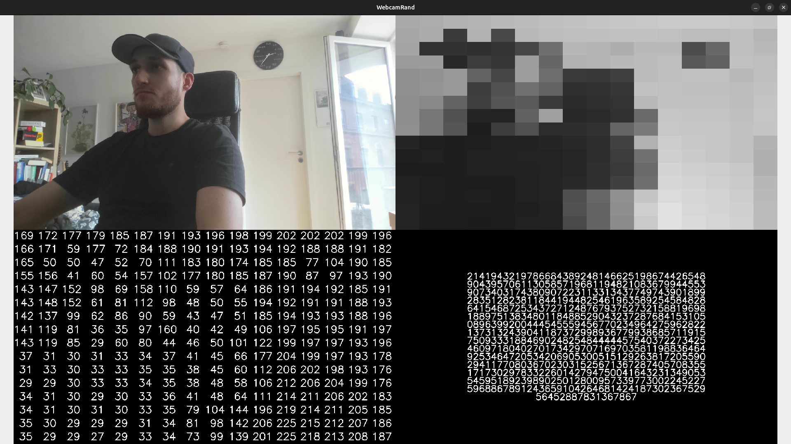

# WebcamRand
This is a small script showing how images, in this case a live webcam feed, can be used to generate random numbers.
This is not a cryptographically secure random number generator!
This is just for presentations (especially for non-comp-sci people) about what randomness is, how you can source it and how it's used in a computer.

This is similar to [Lavarand](https://en.wikipedia.org/wiki/Lavarand), a hardware random number generator that uses a video feed of lava lamps.
[Cloudflare](https://blog.cloudflare.com/harnessing-office-chaos/) uses Lavarand and other chaotic systems for randomness.
WebcamRand is meant to make the idea behind these systems easy to show off.

The top left shows the live camera feed.  
The top right shows the 16x16 gray scaled center of the live feed.  
The bottom left shows how the pixels in the top right image are represented in memory.  
The bottom right shows all the numbers in the bottom left interpreted as a single integer.

When showing this to someone, make them hold their arm horizontally and move it from the top of the video to the bottom.
They should be able to see their movement in the bottom left representation of the pixelated camera feed.

You can also block the camera such that the feed gets less random.
I found that a privacy cover for the webcam works best.
You should see very little changes in the bottom left compared to actual video where something is happening.